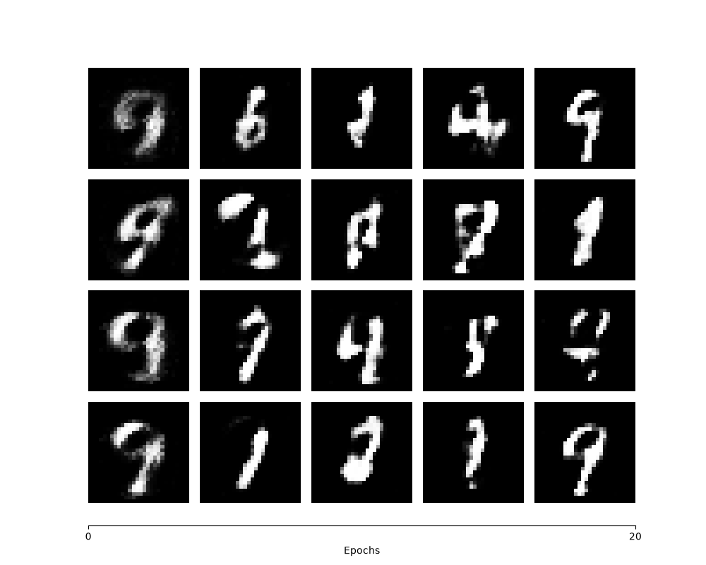
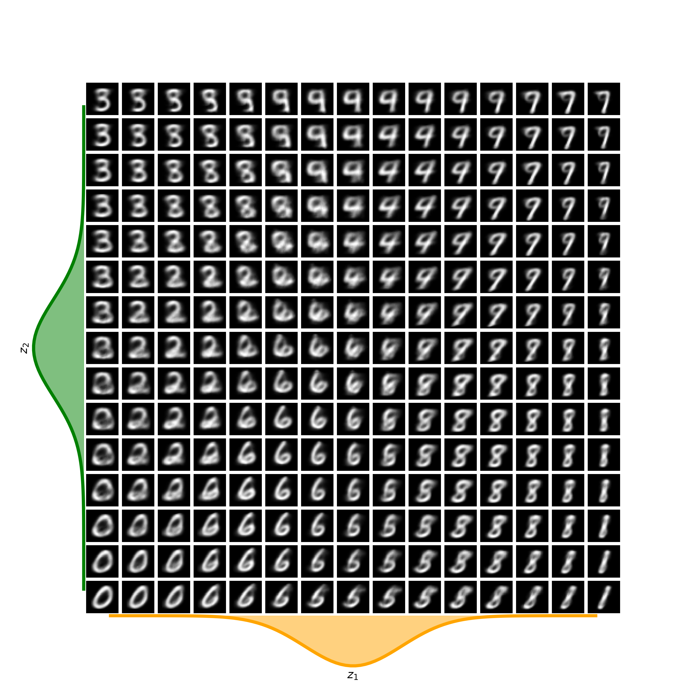

# Robotics Foundation Model

## Part 1. Foundations of Deep Generative Models

### Generative Adversarial Networks (2014) [:page_facing_up:](https://arxiv.org/pdf/1406.2661)

#### - Unrolled approximate inference networks

- An approximate inference network learns an approximate ) of the true posterior ).
- An unrolled approximate inference network obtains this approximation through multiple iterative inference steps instead of single forward pass.

#### - Undirected graphical models with latent variables

- An undirected graphical model defines the relationship between the latent variable  and the observed variable  using an energy function rather than a directed conditional probability.

### Auto-Encoding Variational Bayes (2013) [:page_facing_up:](https://arxiv.org/pdf/1312.6114)

#### - Mean-field variational inference

- An approach to variational inference that approximates the posterior by assuming that the latent variables are independent.

  =\prod_{j=1}^{K}q_j(z_j))

#### - Derivation of Equations (1), (2), and (3)

  })=D_{KL}(q_{\phi}(z|x^{(i)})||p_{\theta}(z|x^{(i)}))&plus;\mathfrak{L}(\theta,\phi;x^{(i)}))

  })=E_{q_{\phi}(z|x)}[-\log&space;q_{\phi}(z|x)&plus;\log&space;p_{\theta}(x,z)])

  }[-\log&space;\frac{q_{\phi}(z|x)}{p_{\theta}(z)}&plus;\log&space;p_{\theta}(x&space;|&space;z)])

  \log&space;\frac{q_{\phi}(z|x)}{p_{\theta}(z)}&plus;\mathbb{E}_{q_{\phi}(z|x)}[\log&space;p_{\theta}(x&space;|&space;z)])

  ||p_{\theta}(z))&plus;\mathbb{E}_{q_{\phi}(z|x)}[\log&space;p_{\theta}(x&space;|&space;z)])

## Part 2. Foundations of Transformer Architectures

### Attention Is All You Need [:page_facing_up:](https://arxiv.org/pdf/1706.03762)
### An Image is Worth 16x16 Words [:page_facing_up:](https://arxiv.org/pdf/2010.11929)
### Learning Transferable Visual Models From Natural Language Supervision [:page_facing_up:](https://arxiv.org/pdf/2103.00020)
### DINOv2: Learning Robust Visual Features without Supervision [:page_facing_up:](https://arxiv.org/pdf/2304.07193)
### Sigmoid Loss for Language Image Pre-Training [:page_facing_up:](https://arxiv.org/pdf/2303.15343)

## Part 3. Diffusion Probabilistic Models

### Deep Unsupervised Learning using Nonequilibrium Thermodynamics (2015) [:page_facing_up:](https://arxiv.org/pdf/1503.03585)

#### Meaning of Equation. (1)

  =\int&space;dy'&space;T_{\pi}(y|y';\beta)\pi(y')) : ) is the stationary distribution of the Markov diffusion kernel  .

  - ) : Markov diffusion kernel (Markov transition kernel)
  - ) : Stationary distribution of 
  -  : diffusion rate

#### Derivation of Equations (11), (12)

  }q(x^{(0)})\cdot&space;\log&space;\begin{bmatrix}\int&space;dx^{(1...T)}q(x^{(1...T)}|x^{(0)})\cdot&space;p(x^{(T)})\prod_{t=1}^{T}\frac{p(x^{(t-1)}|x^{(t)})}{q(x^{(t)}|x^{(t-1)})}\end{bmatrix})
  }q(x^{(0)})\cdot&space;\int&space;dx^{(1...T)}q(x^{(1...T)}|x^{(0)})\log&space;\begin{bmatrix}p(x^{(T)})\prod_{t=1}^{T}\frac{p(x^{(t-1)}|x^{(t)})}{q(x^{(t)}|x^{(t-1)})}\end{bmatrix})
  }q(x^{(0...T)}|x^{(0)})\log&space;\begin{bmatrix}p(x^{(T)})\prod_{t=1}^{T}\frac{p(x^{(t-1)}|x^{(t)})}{q(x^{(t)}|x^{(t-1)})}\end{bmatrix})

### Denoising Diffusion Probabilistic Models [:page_facing_up:](https://arxiv.org/pdf/2006.11239)
### Score-Based Generative Modeling through Stochastic Differential Equations [:page_facing_up:](https://arxiv.org/pdf/2011.13456)
### High-Resolution Image Synthesis with Latent Diffusion Models [:page_facing_up:](https://arxiv.org/pdf/2112.10752)
### Scalable Diffusion Models with Transformers [:page_facing_up:](https://arxiv.org/pdf/2212.09748)
### Flow Matching for Generative Modeling [:page_facing_up:](https://arxiv.org/pdf/2210.02747)

## Part 4. Diffusion-Based Robot Learning

### Diffusion Policy: Visuomotor Policy Learning via Action Diffusion [:page_facing_up:](https://arxiv.org/pdf/2303.04137)
### Diffusion Models for Robotic Manipulation: A Survey [:page_facing_up:](https://arxiv.org/pdf/2504.08438)
### Latent Diffusion Policy: Shaping Latent Spaces for Diffusion-Based Robotic Manipulation [:page_facing_up:](https://arxiv.org/pdf/2606.08657)
### RDT-1B: a Diffusion Foundation Model for Bimanual Manipulation [:page_facing_up:](https://arxiv.org/pdf/2410.07864)
### Octo: An Open-Source Generalist Robot Policy [:page_facing_up:](https://arxiv.org/pdf/2405.12213)

## Part 5. Vision-Language-Action Foundation Models

### RT-1: Robotics Transformer for Real-World Control at Scale [:page_facing_up:](https://arxiv.org/pdf/2212.06817)
### RT-2: Vision-Language-Action Models Transfer Web Knowledge to Robotic Control [:page_facing_up:](https://arxiv.org/pdf/2307.15818)
### OpenVLA: An Open-Source Vision-Language-Action Model [:page_facing_up:](https://arxiv.org/pdf/2406.09246)
### Vision-Language-Action Models for Robotics A Review Towards Real-World Applications [:page_facing_up:](https://arxiv.org/pdf/2510.07077)
### π0: A Vision-Language-Action Flow Model for General Robot Control [:page_facing_up:](https://arxiv.org/pdf/2410.24164)
### GR00T N1: An Open Foundation Model for Generalist Humanoid Robots [:page_facing_up:](https://arxiv.org/pdf/2503.14734)

## Part 6. Advanced Vision-Language-Action Architectures

### Latent Action Pretraining from Videos [:page_facing_up:](https://arxiv.org/pdf/2410.11758)
### LatentVLA: Efficient Vision-Language Models for Autonomous Driving via Latent Action Prediction [:page_facing_up:](https://arxiv.org/pdf/2601.05611v1)
### SmolVLA: A Vision-Language-Action Model for Affordable and Efficient Robotics [:page_facing_up:](https://arxiv.org/pdf/2506.01844)
### CogACT: A Foundational Vision-Language-Action Model for Synergizing Cognition and Action in Robotic Manipulation [:page_facing_up:](https://arxiv.org/pdf/2411.19650)
